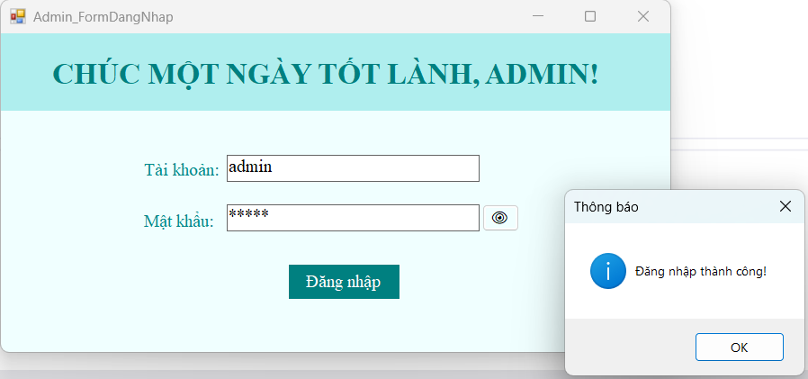
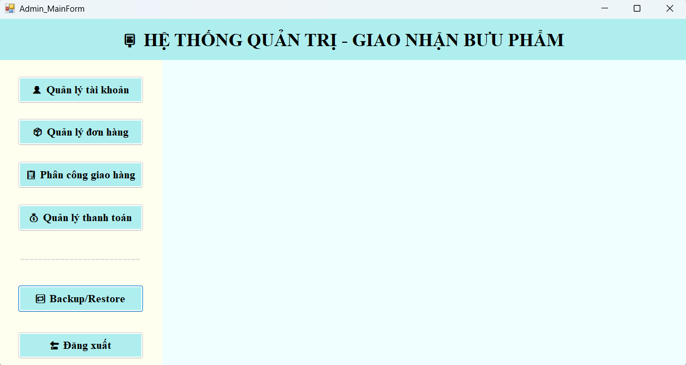
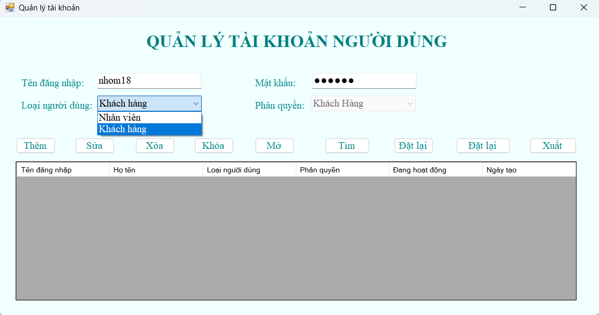
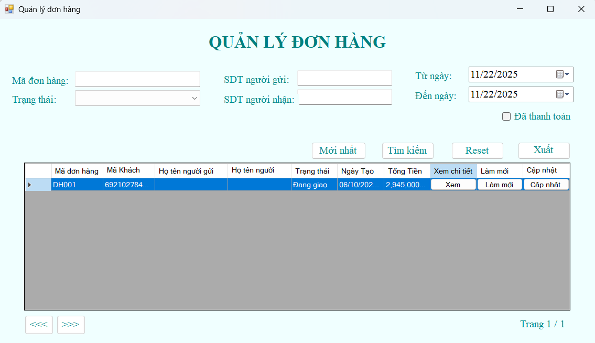
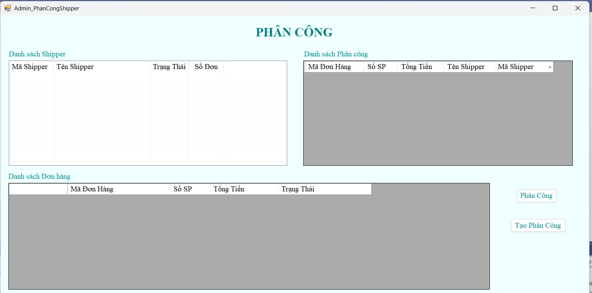
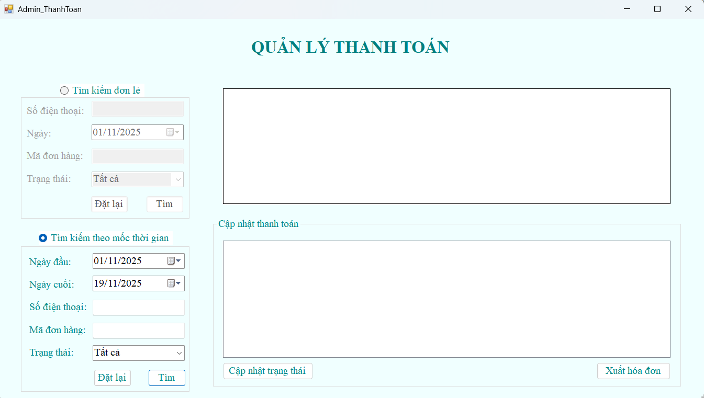
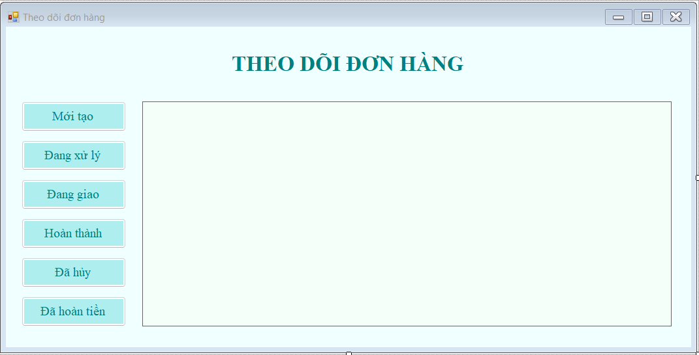
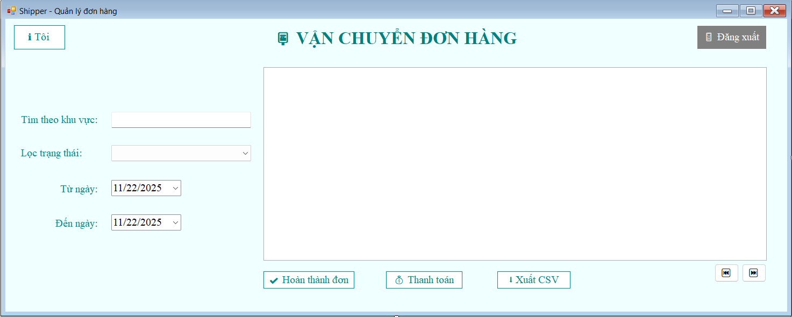

# Parcel Delivery Management System

A desktop application developed for the **NoSQL Database** course using **MongoDB**, **Studio 3T**, and **C# WinForms**. The system supports parcel delivery management, including user management, order processing, shipment tracking, payment management, and database backup/restore.

---

## Project Overview

This project was developed as part of the **NoSQL Database** course, combining **MongoDB**, **Studio 3T**, and **C# WinForms** to build a Parcel Delivery Management System.

The application supports managing delivery orders, users, shippers, and tracking parcel delivery status through a role-based management system.

---

## Objectives

- Learn and apply Studio 3T for MongoDB administration.
- Design a NoSQL database for a parcel delivery management system.
- Develop a desktop application using C# WinForms.
- Implement CRUD operations, data queries, statistics, and database backup/restore.

---

## Tech Stack

| Category | Technology |
|-----------|------------|
| Language | C# |
| Framework | .NET WinForms |
| Database | MongoDB |
| Database Tool | Studio 3T |
| Driver | MongoDB.Driver |
| IDE | Visual Studio 2022 |

---

## System Features

### Administrator

- Manage user accounts (User, Shipper, Admin)
- Manage all delivery orders
- Assign orders to shippers
- Backup and restore database
- View delivery statistics

### Customer

- Register and log in
- Create delivery orders
- Track order status
- View delivery history

### Shipper

- View assigned delivery orders
- Update delivery status
- Confirm payment
- Export delivery reports to CSV

---

## Database Design

The system consists of three main collections:

- **NguoiDung** – Stores information about customers, administrators, and shippers.
- **DonHang** – Stores parcel order information, delivery status, and payment status.
- **SanPham** – Stores product information embedded within each order.

The database design combines **Embedded Documents** and **References** to optimize storage and query performance.

---

## MongoDB Connection

```csharp
var client = new MongoClient("mongodb://localhost:27017");
var database = client.GetDatabase("GiaoNhanBuuPham");
var collection = database.GetCollection<DonHang_DTO>("DonHang");
```

---

## CRUD Operations

- **Create** – Create new delivery orders
- **Read** – Retrieve parcel order information
- **Update** – Update delivery and payment status
- **Delete** – Delete delivery orders

---

## Documentation

Detailed project documentation is available in the **docs** folder.

- Business Requirements Document (BRD)
- Software Requirements Specification (SRS)
- User Stories
- Use Case Specification

---

## Screenshots

### Login



### Admin Dashboard



### User Management



### Order Management



### Shipper Assignment



### Payment Management



### Create Delivery Order



### Shipper Dashboard



---

## Results

- Successfully developed a parcel delivery management system.
- Successfully connected C# WinForms with MongoDB.
- Implemented complete CRUD operations with MongoDB.
- Implemented shipment tracking, payment management, and role-based access control.
- Implemented database backup and restore.
- Developed an intuitive WinForms user interface.

---

## Future Improvements

- Optimize performance for large datasets.
- Develop a RESTful API using ASP.NET Core.
- Build a web or mobile version.
- Integrate real-time parcel tracking.

---

## Author

**Nguyễn Hoàng Bích Trâm**

Business Analyst | .NET Developer

GitHub: https://github.com/nhbichtram94

This repository is maintained as part of my personal portfolio. The project was completed as a university team project.
